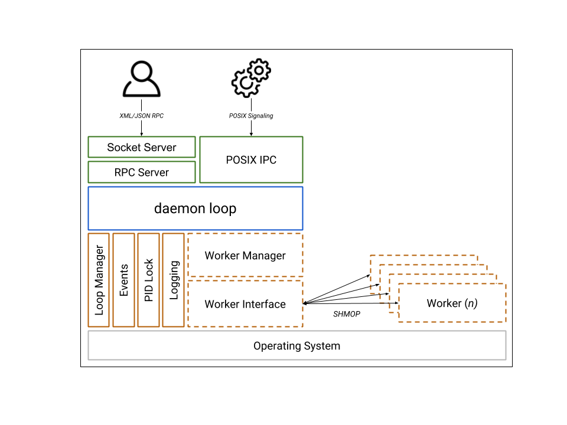

.. _general:

General concepts
================

.. _comodojo/daemon: https://github.com/comodojo/daemon
.. _comodojo/rpcserver github repo: https://github.com/comodojo/rpcserver
.. _wikipedia: https://en.wikipedia.org/wiki/Daemon_(computing)
.. _shared memory segments (SHMOP): http://php.net/manual/en/book.shmop.php

This library provides basic tools to create solid PHP daemons that can:

- spawn and control multiple workers,
- communicate via unix/inet sockets using structured RPC calls,
- receive and handle POSIX signals using a signal-to-event bridge, and
- maintain small memory footprint.

The following picture shows the high level architecture of the `comodojo/daemon`_ package.

    comodojo/daemon v1.X architecture

The big picture
---------------

According to `wikipedia`_:

    [...] a daemon is a computer program that runs as a background process, rather than being under the direct control of an interactive user.

Starting from the ground up, the structure of this library reflects the above definition: the ``\Comodojo\Daemon\Process`` abstract class provides all the basic methods to create a standard \*nix process that can handle OS signals and set its own niceness.

The ``\Comodojo\Daemon\Daemon`` abstract class extends the previous one with all the fancy daemon features. When extended and instantiated, this class, basically:

- forks itself and close the parent process (to became an orphaned process)
- detaches from STDOUT, STDERR, STDIN and became a session leader
- creates and inject event listeners to react to common \*nix signals (SIGTERM, SIGINT, SIGCHLD)
- creates a communication socket
- start the internal daemon loop

Creating a simple echo daemon this way took just a couple of lines:

.. code-block:: php
    :linenos:

    <?php namespace My\Echo\Daemon;

    use \Comodojo\Daemon\Daemon as AbstractDaemon;
    use \Comodojo\RpcServer\RpcMethod;

    class Daemon extends AbstractDaemon {

        public function setup() {
            $echo = RpcMethod::create("my.echo", function($params, $daemon) {
                $message = $params->get('message');
                return $message;
            }, $daemon)
                ->setDescription("I'm here to reply your data")
                ->addParameter('string','message')
                ->setReturnType('string');

            $this->getSocket()
                ->getRpcServer()
                ->methods()
                ->add($echo);
        }

    }

Daemon loop
-----------

The daemon itself is designed to handle communication via socket or at the OS level. That's why the main loop in `comodojo/daemon`_ is implemented ad the socket level, i.e. the daemon loop endlessly waiting for incoming connections. Once received, the socket calls the internal RPC server to execute the command (if any). This behaviour can not be changed.

.. note:: See `comodojo/rpcserver github repo`_ for more information about RPC server.

Socket communication
--------------------

TBW

POSIX signals and signal-to-event bridge
----------------------------------------

Once received, a POSIX signal is automatically converted into a ``\Comodojo\Daemon\Events\PosixEvent`` event that will fire hooked listeners. In this way the framework can be customized to react to specific events according to user needs.

Predefined listeners are in place to handle most common system events; the ``\Comodojo\Daemon\Listeners\StopDaemon``, for example, is designed to react on SIGTERM and to close the daemon gracefully.

Workers and Worker management
-----------------------------

Workers are the standard way to create extended logic inside a project based on `comodojo/daemon`_.

A worker is a child process, forked from the daemon, that implements another kind of loop; the daemon itself constantly monitors the status of the worker and keeps an always open bidirectional communication channel using `shared memory segments (SHMOP)`_.

In other words, a worker can actually do a "specialized work" independently from the parent process, without exposing another socket, relying on the daemon for external communications.
