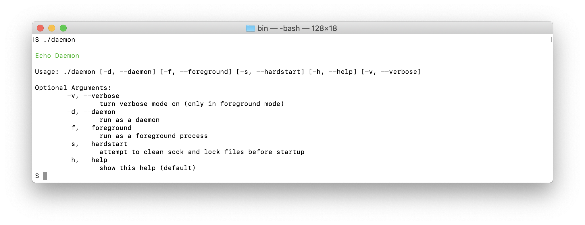

Using the library
=================

Creating a daemon with this library requires at least two steps:

1. create your own daemon class, defining methods to be exposed via RPC socket,
2. create the daemon exec file, that will init the above mentioned class providing basic configuration.

Workers can be also injected to the daemon in the second step.

Defining the daemon
-------------------

Your new daemon should extend the ``\Comodojo\Daemon\Daemon`` abstract class, implementing the abstract ``setup`` method.

The main purpose of this method is to define all the commands that the daemon will accept from the input socket.

Let's take as an example the dummy *echo* daemon mentioned in :ref:`general` section:

.. code-block:: php
    :linenos:

    <?php namespace My\Echo\Daemon;

    use \Comodojo\Daemon\Daemon as AbstractDaemon;
    use \Comodojo\RpcServer\RpcMethod;

    class Daemon extends AbstractDaemon {

        public function setup() {

            // define the echo method
            $echo = RpcMethod::create("my.echo", function($params, $daemon) {
                $message = $params->get('message');
                return $message;
            }, $daemon)
                ->setDescription("I'm here to reply your data")
                ->addParameter('string','message')
                ->setReturnType('string');

            // inject the method to the daemon internal RPC server
            $this->getSocket()
                ->getRpcServer()
                ->methods()
                ->add($echo);
        }

    }

The *my.echo* RPC method expects a string parameter *message* that will be replied by the server.

Now that we have our first daemon, let's figure out how to start it.

Creating the exec script
------------------------

The exec script typically provides only the basic configuration to the daemon class.

Following an example exec script that init the daemon using an inet/tpc socket on port 10042.

.. code-block:: php
    :linenos:

    #!/usr/bin/env php
    <?php

    require "vendor/autoload.php";

    use \My\Echo\Daemon;

    $configuration = [
        'description' => 'Echo Daemon',
        'sockethandler' => 'tcp://127.0.0.1:10042'
    ];

    $daemon = new Daemon($configuration);

    $daemon->init();

.. note:: for a complete list of configuration parameters, refer to the :ref:`configuration` section.

Once saved and made executable, the daemon is ready start.

Running the daemon
------------------

If called with no arguments, the exec script will present the default daemon console:

    comodojo/daemon default console

The *-d* (run as a daemon) and the *-f* (run in foreground) arguments are the most important to understand. If *-d* is selected,
the script will act as a daemon (forking itself, detaching from IO, ...), while the *-f* keeps the script in foreground and the standard shell IO.

So, it's trivial to understand that the main purpose of the *-f* argument is to enable the debug at run-time.

Two typical combination of arguments are the following:

- run the daemon, (eventually) cleaning the socket and the locker: *./daemon -d -s*
- run the daemon in foreground, enabling debug: *./daemon -f -v*

Interacting with the daemon
---------------------------

TBW
